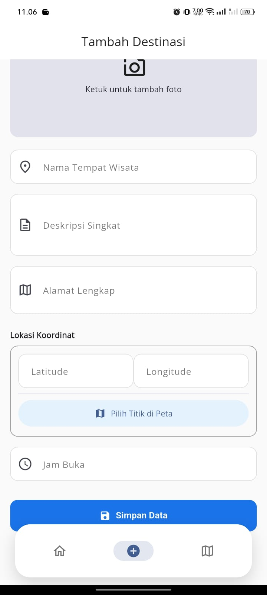
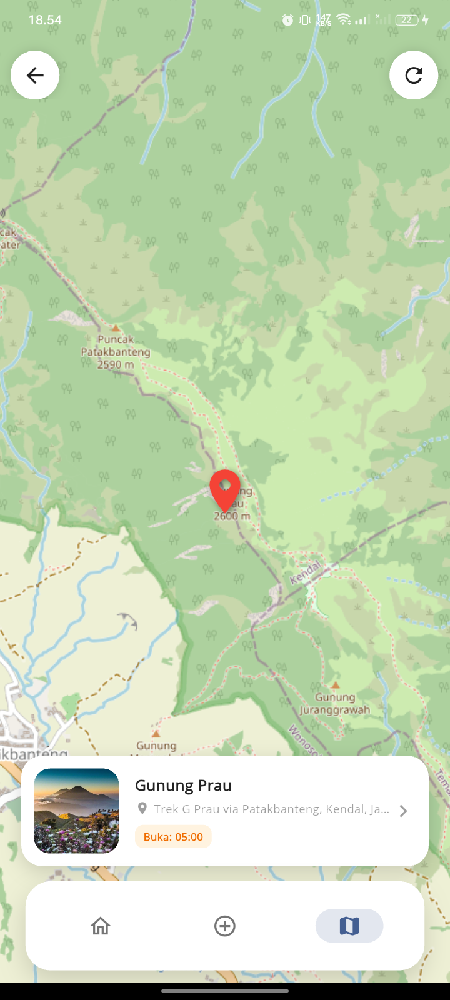

# Travel Wisata Lokal 🌍

Aplikasi mobile berbasis Flutter untuk mencatat dan memetakan destinasi wisata lokal favorit Anda. Proyek ini dibuat untuk memenuhi **Tugas Besar Mata Kuliah Pemrograman Mobile**.

---

## 📥 Tautan Penting (Deliverables)
Berikut adalah kelengkapan tugas sesuai instruksi:

* 📱 **Download APK:** [Klik di sini untuk unduh file .apk](https://drive.google.com/drive/folders/1LjjL3-G7cGzTNe2ffQSWEC65ZQBjgl9j?usp=sharing)
* 🎥 **Video Presentasi:** [Tonton Demo di YouTube](https://youtu.be/XXNnVVDZlWs)
* 📄 **Dokumen Laporan:** [Lihat PDF Laporan](https://drive.google.com/file/d/1htiyMocResw5nzMVJ24nfTv3YoNZZkOM/view?usp=sharing)

---

## 📱 Fitur Utama
Aplikasi ini memiliki fitur lengkap sesuai standar CRUD dan integrasi Peta:

1.  **CRUD Destinasi Wisata**
    * **Create:** Tambah data wisata baru beserta foto dan lokasi.
    * **Read:** Tampilkan daftar wisata dengan pencarian (*Search*) real-time.
    * **Update:** Edit informasi wisata yang sudah tersimpan.
    * **Delete:** Hapus data wisata yang tidak diinginkan.
2.  **Penyimpanan Lokal (SQLite)**
    * Semua data disimpan permanen di memori HP menggunakan `sqflite`. Data tidak hilang saat aplikasi ditutup.
3.  **Peta Interaktif (OpenStreetMap)**
    * Menampilkan sebaran lokasi wisata dalam bentuk Marker di peta.
    * Klik marker untuk melihat ringkasan informasi.
4.  **UI Modern (Material 3)**
    * Desain bersih dan responsif.
    * Menggunakan *Hero Animation* pada transisi detail gambar.
    * Custom Navigation Bar.

## 🛠️ Teknologi & Paket yang Digunakan

* **Framework:** [Flutter](https://flutter.dev) (SDK >=3.0.0)
* **Bahasa:** Dart
* **Database:** `sqflite` (SQLite untuk Flutter)
* **Peta:** `flutter_map` & `latlong2` (OpenStreetMap)
* **Media:** `image_picker` (Akses Galeri/Kamera)
* **Format:** `intl` (Format Tanggal & Jam)
* **Font:** Google Fonts (Open Sans)

## 🚀 Cara Menjalankan Project

Ikuti langkah ini untuk menjalankan aplikasi di mesin lokal Anda:

1.  **Clone Repository**
    ```bash
    git clone [https://github.com/NikkkDevvv/STI202303392_NikoCahyaPramudya_TugasBesarMobPro.git](https://github.com/NikkkDevvv/STI202303392_NikoCahyaPramudya_TugasBesarMobPro.git)
    cd STI202303392_NikoCahyaPramudya_TugasBesarMobPro
    ```

2.  **Install Dependencies**
    Pastikan koneksi internet stabil untuk mengunduh paket.
    ```bash
    flutter pub get
    ```

3.  **Jalankan Aplikasi**
    Pastikan Emulator atau HP fisik sudah terhubung.
    ```bash
    flutter run
    ```

## 📸 Tangkapan Layar (Screenshot)

| Beranda (List) | Tambah Data | Peta Lokasi | Detail Wisata |
|:---:|:---:|:---:|:---:|
|  |  |  |  |


## 📝 Catatan Teknis (Disclaimer)
* **Peta:** Aplikasi ini menggunakan **OpenStreetMap** (via `flutter_map`) sebagai alternatif Google Maps SDK. Hal ini dilakukan untuk efisiensi resource dan kemudahan pengujian tanpa memerlukan konfigurasi API Key berbayar, namun tetap mempertahankan logika geolokasi (Latitude/Longitude) yang sama.
* **Alamat Otomatis:** Menggunakan layanan Nominatim untuk mengubah koordinat menjadi alamat teks secara otomatis.

---
**Dibuat oleh:**
* **Nama:** Niko Cahya Pramudya
* **NIM:** STI202303392
* **Kelas:** C5.1
* **Prodi:** Teknik Informatika - STMIK Widya Utama

* **Nama:** Salman Ahzam
* **NIM:** STI202303781
* **Kelas:** C5.1
* **Prodi:** Teknik Informatika - STMIK Widya Utama
